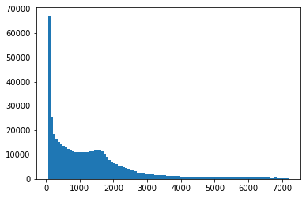
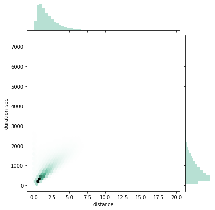
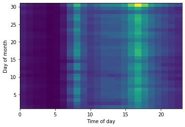
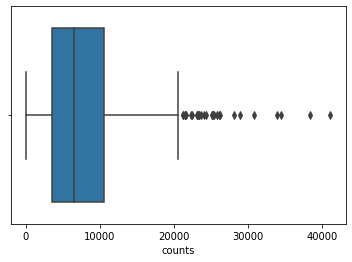

### BIXI Facts
BIXI is available to use for both members and non-members. With a membership you can pay for access to unlimited trips of less than 30 minutes for the time period of the membershp (ranging from just 24 hours to a year). For any trips longer than 30 mintues additional fees apply for each extra minute. This explains why we see so many trips of short duration. The bikes are also available without the membership for single trips, which are of course less economical but good for occasional users. In addtion, they have a partnernship with OPUS (the public transport card for Montreal), to provide reduced fares. This encourages people to use it in conjunction with other available public transport.

The system works with fixed stations. Unlike some bikeshare systems, the bikes must be picked up and returned to existing stations. These stations have a limited number of parking spots. The limited parking places as well as potential depletion of a station may effect our analysis, as some stations would potentially have higher use if there were more stations spots avaiable. The system is also not available during the winter, the bikes and stations are removed from November 15th to April 15th. 

### Cleaning the data
The first task was to combine the separate files for each year and month into a single dataframe. The station data (coordinates) was also merged and the dates converted to datetime and separated by year, month, day and hour for ease of analysis later. Additionally the 'distance' (more accurately displacement) of each trip was calculated using the haversine function (this is the straight line between the start and end station and does not reflect the actual distance traveled by the bike). 

The data was very clean already, with no NaNs, consistent formatting, and a reasonable looking distribution. We will focus on the data from 2019 for our analysis since public transport schedules and infrastructure, as well as the bike share infrastructure change each year, so in order to compare we need to look at a single year. For example the BIXI stations with the same code can change locations each year. The bus schedule also differs and bike lanes are added/demolished.

{: .center-block :}

The above plot illustrates the distribution of return trips (start and end stations are the same). There is a disproportionately high number of trips which return to the same station at a very small duration. This is likely from broken bikes which are signed out but then returned very quickly to the same station. We thus decided to remove these data points, elminating any trips which returned to the same station and have a duration of less than 3 minutes. 

### First look
Lets take a look at the data to see if we can identify any interesting features:

{: .center-block :}

The data shows that people use the service for both short commuting trips and longer journeys. The majority of users however commute with the bike, taking direct routes between stations. As expected the bottom right corner of the plot has no data points since there is a limit to how fast bikers can travel between two stations.

{: .center-block :}

We can see the system is mostly used for short distance trips indicating use for commuting. We see a linear relationship between distance and duration indicating most people take around the same time to bike from one station to the next and not many are completing touring rides (which would appear as a relatively long duration for a short distance). These do appear as well, however at much lower frequency. In addition the increased use around the hours that people go to and get off work supports this conclusion. 

## Center of the hive
We want to know where the bikes are used the most. This gives us an idea for where more stations may be helpful, or more bike paths and infrastructure for biking.

The following boxplot shows the distribution of number of trips taken from a given station. There are only a few stations which are used much more frequently than others, the rest are all used fairly uniformly at a lower frequency:
{: .center-block :}

This is interesting, but more intersting would be to look at how these stations are distributed on a map:
<iframe src="https://daviskia.github.io/maps/bixi/station_use_hm.html" width="100%" height="400px"></iframe>

## Where do they go?
So we know where people are mostly starting their journeys, but where do they go from there? We will now look at not only where people are starting the journeys but the path they take. 

For example the maps below shows the top two station with the most trips starting at that station. The line thickness is proportional to the number of routes completed between those staitons. 

<iframe src="https://daviskia.github.io/maps/bixi/most_pop_path.html" width="100%" height="400px"></iframe>

Instead of looking at a single station we can look at all of the paths to and from each station. From this we can select only the paths which are taken the most frequently. This gives us a good idea not only of where people are starting their trips but where they go in their journeys as well and what areas of the city are most used with the BIXI system. 

{: .box-note}
**Legend:**
- Red dots are the most popular stations to start from (larger diameter means more popular)
- Lines are the most popular routes to take
- Blue dotes are end points which are not one of the most popular stations

<iframe src="https://daviskia.github.io/maps/bixi/bike_routes.html" width="100%" height="400px"></iframe>

These maps and graphs all provide us with a good overview of the BIXI system which can be used in our analysis of how it itegrates into the Montreal's overall transport infrastructure. Check out the [Public Transport](buses.md) and [Safety](paths.md) pages for more info!