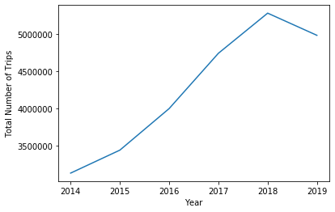

Bikeshare systems are an alternative form of public transport to traditional buses and subways which allow users to pick up and drop of shared bikes at specific stations around the city. The use of the bikeshare system has been increasing, making it an important feature to consider in the city's complete transport system. In the last year however it has begun to decrease; an improvement of the system may be able to bring usage back up. Biking is both more environmentally friendly and more healthy than automobiles, and incorporating this system is a benefit to the city's inhabitants. we thus want to analyse the system to see how people currenlty use the system and then find improvements to maximize and encourage the use of this beneficial form of transport. We especially want to analyse it with respect to it's interactions and incorportation with other tranport infrastructures. 

{: .center-block :}

### What is the BIXI bike system?
BIXI bike is a bikeshare system in Montreal, much like other bikeshare systems around the world. We first wanted to understand however how the system was being used by users and how it was set up. Where do people like using the bikes? What are they using them for? What factors could effect our results?  

[Learn more](bixi.md)

### How safe is it?
One of the main concerns of people riding on bikes in cities is the safety. You are sharing the road with many drivers who may or may not be looking out for bikes. Many people may simply be too afraid to bike along a busy road downtown. Their savior: bike paths. We analysed the density of bike paths across the city to see if people were more likley to go between stations which had a safe route. If this is a major factor, creating more bike lanes between the most popular stations could be a benefit to bikers.

[Learn more](paths.md)

### To Bike or to Bus?
We all want to try and find the fastest way to get from A to B. We also don't want to crowd into a cramped bus with 60 other people. What makes us decide whether to take the bus or metro versus go on a bike? Does the bikeshare help fill the gaps where the buses don't go often? Or do we use it in parallel with the bus lines to have a more pleasant, or even still faster, commuting experience? 

[Learn more](buses.md)

### Will I arrive to work soaking wet?
Here we look at the weather and how that effects the use of bikes. What weather factors increase or decrease bike use? We can't change the weather, but can we modify the system to make biking more friendly year round?

[Learn more](weather.md)

## The Data
For our analysis we worked with 4 different datasets:
1. BIXI Bikeshare trips (type = .csv, files = data for each year and month, station locations and codes for each year)
2. Montreal weather data (type = .csv, files = data for each day, temperature, precipitation, snow and wind max speed)
3. Public transport schedule (type = , files = )
4. Bike paths (type = .geojson, files = )

## Putting it all together..
After analysing the different components of the transport infrastructure separately we then needed to put it all together to create a coherent image.

<iframe src="https://daviskia.github.io/maps/Matching_Bike_Path_Density_Chloropleth_Bus_Lines.html" width="100%" height="400px"></iframe>

<iframe src="https://daviskia.github.io/maps/Matching_Bike_Path_Density_Chloropleth_Metro_Lines.html" width="100%" height="400px"></iframe>
