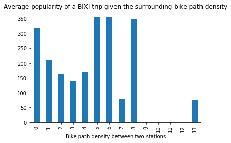

Do you prefer to cycle between two cars or on a quiet cycle path next to the road?
What if the possibility of riding on a road exclusively dedicated to bicycles influenced your itinary?

That is the question we asked ourselves in this section. Our assumption was that the presence of numerous bicycle paths between two stations would influence the popularity of the trip between these same two stations.

# Finding the most bike-friendly area of Montreal

## Our Bike Paths Dataset

The dataset we used comes from the Active Transportation Division of Montreal, it is all the bike paths that have been built or traced in Montreal. These paths consist mainly of bicycle lanes but also include a few on-street paths, sidewalk paths and multi-purpose paths. It can already be seen by displaying these roads on a map that they are not evenly distributed over Montreal. Some areas suffer from the total absence of bicycle paths.

<iframe src="https://daviskia.github.io/maps/safety/Bike_Paths.html" width="100%" height="400px"></iframe>

## Computing Bike-friendliness

To answer our question, we had to find a way to define the bike-friendliness of an area. For a given zone, we therefore defined this magnitude as the total length of bike paths divided by the area of the zone. To give you an idea of the calculation of this magnitude, similar to a bike path density, here is an example below. Our area of interest is demarcated by the red lines. In this rectangle, we keep the bike paths inside and cut off the ends of the bike paths that exit the rectangle.

<iframe src="https://daviskia.github.io/maps/safety/Example_of_bp_density_calculation.html" width="100%" height="400px"></iframe>

We therefore divide an area of interest into different squares to calculate the density. Since calculating this density takes a lot of time, we decided to restrict our study area to where most BIXI stations are concentrated. The result is a nice grid with the density of bicycle paths within each square.

<iframe src="https://daviskia.github.io/maps/safety/Bike_Path_Density_Chloropleth.html" width="100%" height="400px"></iframe>

## Are the most popular BIXI stations in a bike-friendly zone?

<iframe src="https://daviskia.github.io/maps/safety/pop_stat_paths.html" width="100%" height="400px"></iframe>

# Attention : need chloropleth + most popular stations

## Does Bike-friendliness increase popularity of a trip ?

Now that we have found a way to calculate and display bike-friendliness, all we have to do is apply our algorithm between the two stations of each studied trip! For a trip between two BIXI stations, we are therefore able to determine its popularity, given by the number of times it was used during the year, and the density of bike paths in the surrounding area, calculated on the smallest square containing these two stations on the map.

To answer our question, we then selected a sample of more than a thousand bike paths of different popularity to calculate their surrounding bike-friendliness. By displaying the popularity of each density of different bike paths, we expected to see an increase in average popularity as the density increases. Here is what we get, grouping the average densities around integer values:

{: .center-block :}

Our analyses therefore do not allow us to show a correlation between the popularity and the bike-friendliness of a trip. This is understandable because the motivation to take a bike does not mainly depend on the existence of a cycle path between two stations but more on the immediate proximity of a station to the place where one wishes to go. 

To really study if there is an increase, it seems more interesting to look at the difference in popularity of a trip before and after the construction of a bicycle path. Unfortunately, we did not have construction date data for each bike path. Knowing the popularity of a ride before building a bike lane would indeed allow to compare a difference in popularity really related to the new bike lane. This would allow us to get rid of the confusing factor of the location of the trip, which plays the biggest role on the popularity of trips.