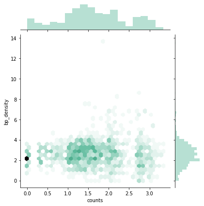

In order to evaluate how safe it is to bike in different areas of the city we took a look at the density of bike paths in each area. The 

Maps we have right now:

<iframe src="https://daviskia.github.io/maps/safety/Bike_Paths.html" width="100%" height="400px"></iframe>

<iframe src="https://daviskia.github.io/maps/safety/Example_of_bp_density_calculation.html" width="100%" height="400px"></iframe>

<iframe src="https://daviskia.github.io/maps/safety/Bike_Path_Density_Chloropleth.html" width="100%" height="400px"></iframe>

<iframe src="https://daviskia.github.io/maps/safety/density_bike.html" width="100%" height="400px"></iframe>

Correlation:

