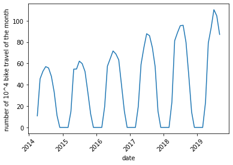
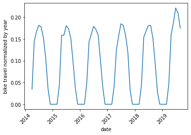
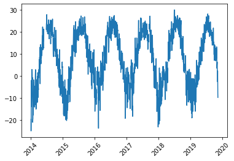
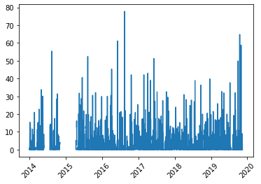
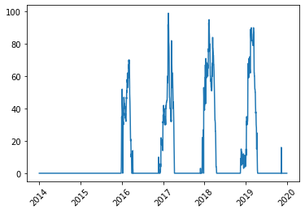
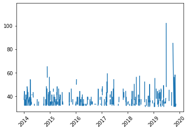
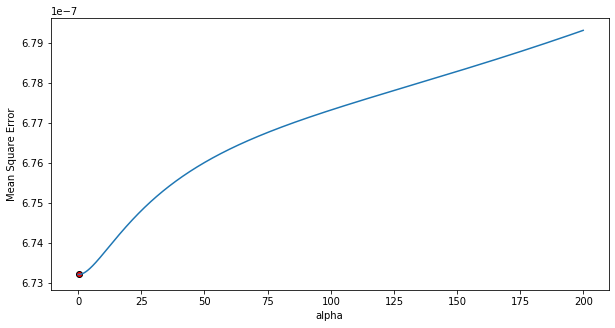
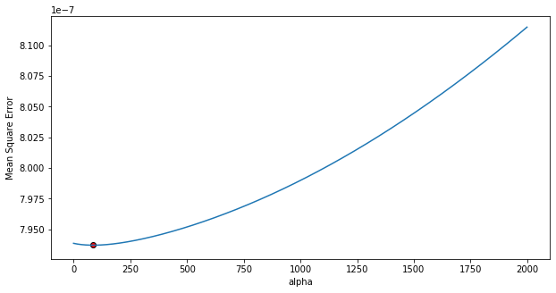
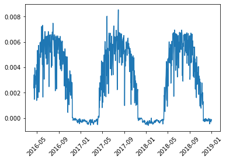

Using the weather dataset of Montreal, we can try to correlate the weather of the day and the use of the bikeshare system. 

**Bixi bikeshare system use throught time**

We tried to analyze the weather dataset and to conclude which parameters, among temperature, precipitation, snow and wind, were the more relevant to people’s mind in order to make their choice.

A first look at the data shows us that the number of bike travel overall increase through year. This has nothing to do with weather, which should be approximately the same every year. So the increasing popularity of the bixi bikeshare system induce some bias in our analysis.

{: .center-block :}

A way to suppress or reduce this bias, is to normalize every number of bike travel per day by the number of bike travel made the corresponding year.

{: .center-block :}

**Weather dataset cleaning**

The weather dataset was relatively clean, thought containing a lot of missing values, especially for the wind. Also the Montreal weather website is in french, so the data were written as string such as 5,6 instead of 5.6, which requires some tricks in order to render the data exploitable. 

Here we can see the evolution of temperature, precipitation, snow and wind max speed from 2014 to 2019.

{: .center-block :}

{: .center-block :}

{: .center-block :}

{: .center-block :}

These graph shows us that weather do not change significantly from one year to another, which confort us in the previous choice of normalization. Also, we can see that there is no snow data before 2016 and that there is a big gap of missing values in the precipitation graph around the beginning of the year 2015.

We could have tried to fill this gap, but in order to not make data tell what it does not tell, we choosed to make the analysis only from year 2016.

Moreover, there is no wind value <31 km/h, which must be due to the sensibility of the weather forecast material, and that leads to a very spare graph concerning the wind data.

**Mathematical analysis**

We performed a Ridge Regression in order to see what parameters could be the more important. As this analysis requires no missing value, in a first step we decided to do it only on day of high wind (>31 km/h). Also we used only data after 2016, not the 2019 data, and during the working month of the bikeshare system (april to november).

Data were normalized in order to have comparable coefficient.

{: .center-block :}

We obtain the following equation :

	Normalize bike travel count = 	
				
				1.83934319e-04 x normalized temperature 

				-7.22697522e-05 x normalized precipitation 

				-1.48001051e-04 x normalized snow on ground 
				
				-1.89050845e-05 x normalized wind max speed

Considering the signs of the coefficients, temperature has a positive influence, and rain, snow, and wind a negative one, as expected thought. 

The major influence is given by temperature, as it is the max absolute value among the coefficient. However we must keep in mind that this is only valid by day of high wind (> 31 km/h).

So we did a second regression, dropping the wind set. 

{: .center-block :}

	Normalize bike travel count = 	
				
				1.72323698e-04 x normalized temperature

				-7.82654802e-05 x normalized precipitation
				
				-5.90781277e-05 x normalized snow on ground 

Once again, temperature is a positive factor and rain and snow are negative ones, which makes sense.
Temperature is the principal factor in Montreal that will make you decide whether or not you will use the public bike.

**Prediction**

Now that we have such a model, we could try to predict what would be the bike use during winter if the bikeshare system was not closed, to see whether or not the closing month choice is appropriate.

We will use the coefficient of the second Ridge Regression, during years 2016, 2017 and 2018. To that end, we must use normalized data of the winter month.

{: .center-block :}

We see that during closure (16th of October to the 14th of April), the predictive model we built shows value almost null. 
Temperature, rain and snow during this month would discourage bike use...

It is relevant that the system close during that time, and no change is adviced.

