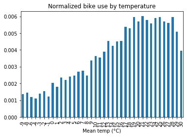

Using the weather dataset of Montreal, we can try to correlate the weather of the day and the use of the bikeshare system. 

**Bixi bikeshare system use throught time**

We tried to analyze the weather dataset and to conclude which parameters, among temperature, precipitation, snow, and wind, were the more relevant to people to make their choice on whether to bike.

The amount of bike travel (using the BIXI system) overall increases each year. This has nothing to do with weather, which should be approximately the same every year. So the increasing popularity of the bixi bikeshare system introduces some bias.

{: .center-block :}

We reduce this bias by normalizing the amount of bike travel per day (measured by the number of trips) by the number of trips made in the corresponding year.

{: .center-block :}

**Weather dataset cleaning**

The weather dataset was relatively clean, though it contained a lot of missing values and thus requires some tricks in order to render the data exploitable. 

Here we can see the evolution of temperature, precipitation, snow and wind max speed from 2014 to 2019.

{: .center-block :}

{: .center-block :}

{: .center-block :}

{: .center-block :}

Weather does not change significantly from one year to the next, which comforts us in the previous choice of normalization. Also, there is no snow data before 2016 and there is a big gap of missing values in the precipitation graph around 2015.

We could have tried to fill this gap, but to avoid making the data tell what it does not tell, we chose to do the analysis starting from year 2016.

In addition, there are no wind values <31 km/h, which is likely due to the sensitivity of the weather forecast material, and that leads to a very spare graph concerning the wind data.

**Mathematical analysis**

If we plot the average bike use against temperature we find the expected results: low temperatures reduce bike use.
{: .center-block :}

We did a Ridge Regression to see which weather parameters are most important. In the first step we decided to include only data meeting the following criteria: high wind (>31 km/h), after 2016, eliminating 2019 data, during the working months of the bikeshare system (April to November).

The data was normalized in order to have comparable coefficients.

{: .center-block :}

We obtain the following equation :

	Normalize bike travel count = 	
				
				1.83934319e-04 x normalized temperature 

				-7.22697522e-05 x normalized precipitation 

				-1.48001051e-04 x normalized snow on ground 
				
				-1.89050845e-05 x normalized wind max speed

Considering the signs of the coefficients, temperature has a positive influence, while rain, snow, and wind a negative one, as expected. 

The biggest influence is given by temperature, as it is the maximum absolute value among the coefficients. However, we must keep in mind that this is only valid for days with high wind (> 31 km/h).

So we did a second regression, dropping the wind set:

{: .center-block :}

	Normalize bike travel count = 	
				
				1.72323698e-04 x normalized temperature

				-7.82654802e-05 x normalized precipitation
				
				-5.90781277e-05 x normalized snow on ground 

Once again, temperature is a positive factor and rain and snow are negative ones.
Temperature is the principal factor in Montreal that will make you decide whether or not you will use the public bike.

**Prediction**

Now that we have such a model, we could try to predict the bike use during winter if the bikeshare system remained open, to see whether or not the closing month choice is appropriate.

We used the coefficient of the second Ridge Regression, during the years 2016, 2017 and 2018. To that end, we normalized the data of the winter months.

{: .center-block :}

We see that during closure (16th of October to the 14th of April), the predictive model we built shows values at almost zero. 
Temperature, rain, and snow during these months would discourage bike use...

It is logical then that the system closes during that time, and no change is advised. 

